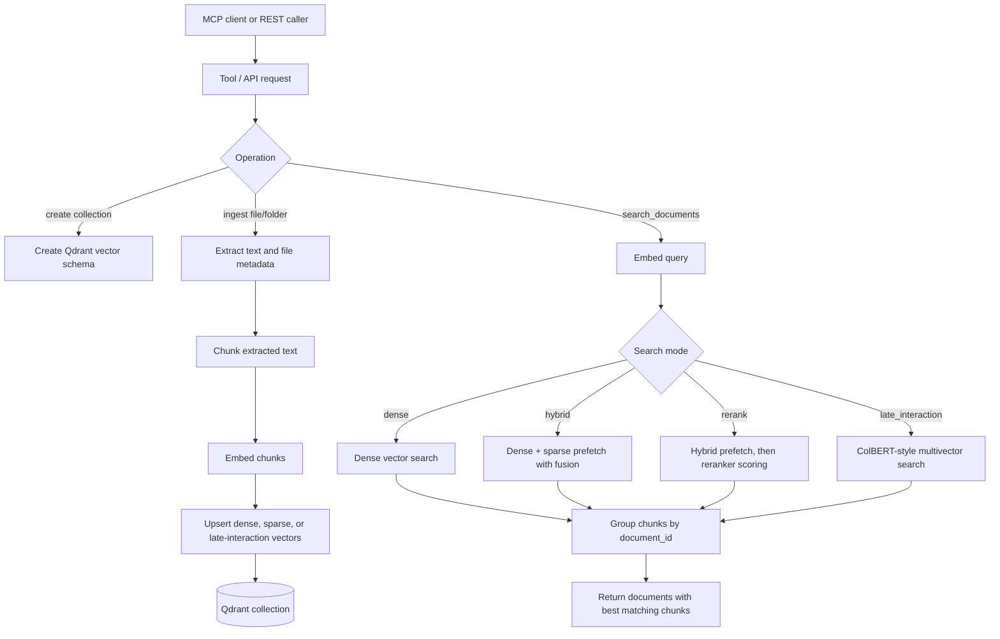

# mcp-server-qdrant-enhanced

Local retrieval infrastructure for MCP clients, desktop agents, and REST users.
It stores documents in Qdrant, embeds them with the configured model, and exposes
tools for ingestion, collection setup, semantic search, hybrid search, reranking,
metadata discovery, and safe destructive operations.

The repository is a Python package named `mcp-server-qdrant`. It provides two
entry points:

- `mcp-server-qdrant`: MCP server over `stdio`, `sse`, or `streamable-http`.
- `mcp-server-qdrant-webui`: FastAPI REST surface for non-MCP clients.

The default local profile is intended for real day-to-day use: document-level
search, folder/file ingestion, collection creation, hybrid collection creation,
late-interaction collection creation, embedding model assignment, and discovery
tools are enabled. Raw chunk-level and destructive tools are available only when
the server is started with the `full` tool profile.

## What This Server Does

At a high level, the server turns files or text into searchable Qdrant points,
then returns ranked evidence grouped by document.



The ingest path preserves payload metadata such as path, filename, parent path,
document id, chunk index, total chunks, character count, page count when
available, extraction method, ingest time, and macOS metadata when available.

## Enabled MCP Functions

Tool visibility is controlled by `QDRANT_MCP_TOOL_PROFILE`. The default is
`canonical`.

### Minimal Profile

Set `QDRANT_MCP_TOOL_PROFILE=minimal` for the smallest useful read/search
surface.

| Tool | Purpose |
| --- | --- |
| `search_documents` | Main document-level search tool. Supports `dense`, `hybrid`, `rerank`, and `late_interaction` modes. Returns distinct documents with their best chunks. |
| `ingest_file` | Extracts, chunks, embeds, and stores one supported file. Supports dense, hybrid, and late-interaction ingest modes. |
| `ingest_folder` | Recursively ingests supported files from a folder. Supports `run_mode=report` dry runs and `run_mode=apply`. |
| `list_embedding_models` | Lists embedding models known to the server and supported distance metrics. |
| `list_collections` | Lists Qdrant collections. |
| `get_collection_info` | Returns collection counts, vector size, distance metric, status, and optimizer status. |
| `get_indexed_fields` | Shows indexed payload fields and the supported filter grammar. |
| `get_supported_extractors` | Lists supported file extensions and extraction methods. |
| `get_collection_schema` | Returns schema and status for a specific collection. |
| `list_search_modes` | Describes `dense`, `hybrid`, `rerank`, and `late_interaction`. |
| `get_server_capabilities` | Returns server profile, transports, enabled feature flags, extractors, search modes, and available models. |

### Canonical Profile

`canonical` includes all minimal tools plus setup and collection lifecycle tools.
This is the default profile.

| Tool | Purpose |
| --- | --- |
| `create_collection` | Creates a dense-vector collection for a chosen embedding model. |
| `create_hybrid_collection` | Creates a collection with dense and sparse vector slots for hybrid retrieval. |
| `create_late_interaction_collection` | Creates a multivector collection for ColBERT-style MaxSim retrieval. |
| `bootstrap_collection_indexes` | Creates macOS/document metadata payload indexes on an existing collection. |
| `set_collection_embedding_model` | Assigns an embedding model to a collection without changing global server state. |

### Full Profile

Set `QDRANT_MCP_TOOL_PROFILE=full` for raw/admin tools. Use this profile with
care because it exposes destructive and low-level operations.

| Tool | Purpose |
| --- | --- |
| `delete_collection` | Deletes a collection with a two-step `report` then `apply` plan gate. |
| `qdrant_find` | Legacy/raw chunk-level semantic search. |
| `qdrant_store` | Stores one raw text entry. |
| `qdrant_store_batch` | Stores multiple raw text entries. |
| `scroll_collection` | Browses raw collection entries with pagination. |
| `hybrid_search` | Legacy chunk-level scored search. |

When `QDRANT_READ_ONLY=true`, write and mutation tools are not registered.

## REST API Functions

The FastAPI app mirrors the main capabilities for JSON HTTP callers:

| Endpoint | Purpose |
| --- | --- |
| `GET /health` | Health, active embedding model, vector size, and write queue stats. |
| `GET /collections` | List collections. |
| `GET /collections/{name}` | Collection details. |
| `POST /collections` | Create a dense collection. |
| `POST /collections/hybrid` | Create a hybrid dense+sparse collection. |
| `DELETE /collections/{name}` | Delete a collection. |
| `POST /collections/{name}/bootstrap_indexes` | Ensure metadata payload indexes. |
| `POST /store` | Store one raw text entry. |
| `POST /store_batch` | Store raw text entries in bulk. |
| `GET /scroll/{name}` | Browse collection entries. |
| `POST /search` | Chunk-level search. |
| `POST /search_documents` | Document-level grouped search. |
| `POST /ingest/file` | Ingest one file. |
| `POST /ingest/folder` | Ingest a folder. |
| `GET /embedding_models` | List available embedding models. |
| `POST /embedding_models/active` | Change the active REST embedding provider. |

### Quick Start with Config File

The easiest way to get running is with the configuration file:

```bash
# 1. Copy and edit the config
cp qdrant-enhanced.yaml ~/.config/mcp-server-qdrant/config.yaml

# 2. Start Qdrant (native binary or Docker)
./scripts/local-run-qdrant.sh

# 3. Start the MCP server — reads config automatically
./scripts/run-server-mcp.sh --transport streamable-http
```

## Configuration

All settings are consolidated in a single YAML file.

### Config file location

The first file found is used (priority order):
1. `$QDRANT_CONFIG` environment variable
2. `./qdrant-enhanced.yaml` (relative to working directory)
3. `~/.config/mcp-server-qdrant/config.yaml`

### Priority chain

```
CLI args / request params
  → environment variables
    → config file (qdrant-enhanced.yaml)
      → built-in defaults
```

Environment variables always override the config file. Set `QDRANT_MODE=embedded`
to override `qdrant-enhanced.yaml` without editing it.

### Config reference

See `qdrant-enhanced.yaml` in the repo root for a fully annotated example.
Key sections:

| Section | Controls |
|---------|----------|
| `runtime` | Qdrant mode/URL, MCP transport, tool profile |
| `models` | Embedding model, sparse model, reranker, Qwen3 sidecar |
| `ingest` | Chunk size, batch size, write concurrency |
| `search` | Default mode, rerank limits, diversity |
| `collections` | Default collection name, naming conventions |

## Installation

Requirements:

- Python 3.10 or newer.
- `uv`.
- Native Qdrant binary (recommended for multi-agent server mode) or Docker.
  The project ships a macOS arm64 binary at `.local/bin/qdrant` (v1.17.1).
  A LaunchAgent at `~/Library/LaunchAgents/com.qdrant.server.plist` auto-starts it on login.
- Rust toolchain, only if building the Qwen3 embedding sidecar locally.
- macOS for Apple Silicon Metal/MPS acceleration and macOS metadata capture.

Install Python dependencies and build the Qwen3 sidecar:

```bash
./scripts/local-install.sh
```

Equivalent manual install:

```bash
uv sync --frozen --group dev
cargo build --release --manifest-path rust/qwen3_embedder/Cargo.toml
```

Optional reranker dependencies for Qwen3 reranker models:

```bash
uv pip install 'mcp-server-qdrant[reranking]'
```

Run the test suite:

```bash
uv run --locked pytest
```

## Running Locally

### Recommended Setup

For multi-agent use, run Qdrant as a persistent server and connect MCP clients
to it.

Recommended infrastructure:

- **Qdrant**: native server at `http://127.0.0.1:6333`
- **MCP**: server mode with `QDRANT_MODE=server`
- **Embedded mode**: development/testing only

Recommended retrieval policy:

- Use **hybrid collections** for general-purpose RAG.
- Use `mode="hybrid"` as the normal starting point.
- Use `mode="rerank"` for higher-quality evidence selection.
- Use `mode="late_interaction"` for high-recall conceptual search, but only
  with a late-interaction collection.
- Do not switch embedding models on an existing collection unless you
  re-ingest.

### Shared Qdrant Server Mode

Server mode lets the MCP server, REST API, and multiple agents share the same
Qdrant instance.

```bash
./scripts/local-run-qdrant.sh
./scripts/run-server-mcp.sh --transport streamable-http
```

The MCP endpoint is:

```text
http://127.0.0.1:8000/mcp/
```

Useful checks:

```bash
./scripts/check-server-qdrant.sh
./scripts/smoke-test-server-mcp.sh
./scripts/local-doctor.sh
```

Run the REST API:

```bash
./scripts/local-run-webui.sh
```

The REST API defaults to:

```text
http://127.0.0.1:8765
```

### Stdio MCP Mode

For clients that spawn the server directly:

```bash
uv run --locked mcp-server-qdrant
```

or with local defaults loaded:

```bash
./scripts/local-run-mcp.sh
```

### Embedded Qdrant Mode (Dev / Single-User Only)

Embedded mode stores Qdrant data in a local directory and locks the storage to
a single process. Use this for local testing, not multi-agent setups.

```bash
QDRANT_MODE=embedded ./scripts/local-run-mcp.sh
```

Embedded mode cannot be shared between the MCP server and the REST API
simultaneously — the storage is locked by whoever opens it first.

## Configuration

Important environment variables:

| Variable | Default | Meaning |
| --- | --- | --- |
| `QDRANT_MCP_TOOL_PROFILE` | `canonical` | Tool surface: `minimal`, `canonical`, or `full`. |
| `QDRANT_URL` | unset | Qdrant server URL. When set, server mode is used. |
| `QDRANT_LOCAL_PATH` | `storage` or `.local/qdrant-storage` via scripts | Embedded Qdrant storage path. |
| `COLLECTION_NAME` | `documents` | Default collection for tools that allow omission. |
| `QDRANT_READ_ONLY` | `false` | Disables write/mutation tools when true. |
| `EMBEDDING_PROVIDER` | `fastembed` | Embedding provider type. |
| `EMBEDDING_MODEL` | `Qwen/Qwen3-Embedding-4B` | Default dense embedding model. |
| `EMBEDDING_DEVICE` | `auto` | Device hint: `auto`, `cpu`, `cuda`, `mps`, or supported local equivalent. |
| `QWEN3_SIDECAR_PATH` | built sidecar path via scripts | Rust Qwen3 embedder binary path. |
| `QDRANT_SPARSE_MODEL` | `Qdrant/bm25` | Sparse model for hybrid/rerank retrieval. |
| `QDRANT_RERANKER_MODEL` | `Xenova/ms-marco-MiniLM-L-6-v2` | Default reranker for `mode=rerank`. |
| `QDRANT_RERANK_PREFETCH_LIMIT` | `0` | Candidate pool before reranking; `0` means auto. |
| `QDRANT_RERANK_TOP_K` | `0` | Max candidates scored by reranker; `0` means all prefetched. |
| `QDRANT_INGEST_CHUNK_SIZE` | `700` | Ingest chunk size in characters. |
| `QDRANT_INGEST_CHUNK_OVERLAP` | `70` | Character overlap between chunks. |
| `QDRANT_WRITE_MAX_CONCURRENCY` | `1` | Concurrent embedding/upsert jobs per server process. |
| `QDRANT_WRITE_QUEUE_SIZE` | `8` | Queued write jobs before requests are rejected. |
| `MCP_TRANSPORT` | `stdio` | `stdio`, `sse`, or `streamable-http`. |
| `MCP_HOST` | `127.0.0.1` | HTTP bind host. |
| `MCP_PORT` | `8000` | HTTP bind port. |
| `MCP_HTTP_AUTH_TOKEN` | unset | Optional bearer token for streamable HTTP. |
| `MCP_HTTP_ALLOWED_ORIGINS` | local defaults | Allowed origins for HTTP Origin validation. |

## How Data Flows

### Collection Setup

1. A client creates a dense, hybrid, or late-interaction collection.
2. The server resolves the requested embedding or late-interaction model.
3. Qdrant receives the correct vector schema: dense vector, dense+sparse
   vectors, or multivectors.
4. Metadata payload indexes can be created up front with
   `bootstrap_collection_indexes`; ingestion also ensures the metadata indexes.

### File Ingestion

1. `ingest_file` or `ingest_folder` receives an absolute path and target
   collection.
2. The extractor reads supported formats:
   `.txt`, `.md`, `.json`, `.jsonl`, `.csv`, `.tsv`, `.pdf`, `.docx`, and many
   code/config text formats.
3. The server collects file metadata and macOS metadata where available.
4. Text is split into paragraph-aware chunks using the configured chunk size and
   overlap.
5. The selected embedding provider embeds the chunks.
6. Dense mode stores dense vectors; hybrid mode stores dense plus sparse BM25 or
   BM42 vectors; late-interaction mode stores multivectors.
7. Qdrant payloads keep the original chunk text under `document` and metadata
   under `metadata`.

### Search

1. `search_documents` receives a query, collection, filter, and retrieval mode.
2. The server resolves the embedding model by request override, collection
   assignment, then process default.
3. Dense mode performs vector search.
4. Hybrid mode uses dense and sparse retrieval and fuses candidates.
5. Rerank mode performs hybrid prefetch, then scores candidates with the
   configured reranker.
6. Late-interaction mode uses a ColBERT-style provider against a multivector
   collection.
7. Results are deduplicated and grouped by `document_id`, then returned as
   documents with top matching chunks, scores, metadata, and warnings.

### Safe Mutations

`ingest_folder` supports `run_mode=report` to preview a folder ingest before
applying it. `delete_collection` is only visible in the `full` profile and
requires a `report` call that returns a `plan_id`, followed by `apply` with that
same plan id.

## Technical Details

- MCP runtime: FastMCP.
- REST runtime: FastAPI and Uvicorn.
- Vector store: Qdrant client, either embedded local storage or server URL.
- Dense embeddings: FastEmbed-compatible providers, with Qwen3 sidecar support.
- Sparse retrieval: `Qdrant/bm25` by default, with BM42 option.
- Reranking: FastEmbed cross-encoders by default; Qwen3 rerankers require the
  `reranking` extra.
- Late interaction: FastEmbed late-interaction provider, defaulting to
  `colbert-ir/colbertv2.0`.
- Write safety: a bounded async write queue serializes or limits embedding and
  upsert work.
- Multi-client safety: collection embedding assignments are persisted per
  collection and resolved per request rather than mutating global MCP state.
- HTTP safety: streamable HTTP binds to loopback by default, validates Origin,
  and supports optional bearer auth.

## Useful Maintenance Commands

```bash
./scripts/reset-server-qdrant.sh
```

Stops local MCP/REST/embedder processes without deleting server-mode Qdrant
storage. Use `--stop-docker`, `--remove-docker`, `--wipe`, or
`--wipe-embedded` only when intentionally changing or deleting local Qdrant
state.

```bash
./scripts/local-configure-hermes.py
```

Writes a local client configuration for Hermes.

## Example MCP Flow

1. Start Qdrant:

   ```bash
   ./scripts/local-run-qdrant.sh
   ```

2. Start MCP:

   ```bash
   ./scripts/run-server-mcp.sh --transport streamable-http
   ```

3. Create a collection with `create_hybrid_collection`.

4. Ingest files with `ingest_folder` using `mode="hybrid"`.

5. Query with `search_documents` using `mode="rerank"` when quality matters or
   `mode="hybrid"` when latency matters.
