# mcp-server-qdrant-enhanced

A production-minded Python server that extends the Qdrant MCP workflow with
two-stage hybrid retrieval, document-level semantic search, Qwen3 embeddings
and reranking on Apple Silicon Metal, dynamic model selection, MCP tool
profiles, secure streamable HTTP transport, and a FastAPI interface for
non-MCP clients.

This project began as an enhancement of the base Qdrant MCP server but has
grown into a practical local AI retrieval layer for desktop agents, MCP
clients, and API consumers. The focus is on retrieval that actually works at
book scale: ingesting files, preserving metadata, searching by distinct
documents rather than raw chunks, and surfacing the right evidence passages.

---

## Architecture

```mermaid
flowchart TD
    subgraph Ingestion
        SRC["Source files\n(PDF, DOCX, MD, JSON, CSV, code…)"]
        EXT["Extractor\n(pdfminer / pypdf / python-docx / text)"]
        CHUNK["Paragraph-aware chunker\n700 char / 70 overlap"]
        EMB["Qwen3-Embedding-4B\n(Rust sidecar · Metal/MPS)"]
        SPARSE_EMB["BM25 / BM42\n(fastembed · CPU)"]
        QDRANT[("Qdrant\n(embedded or server)")]
    end

    subgraph Two-stage Retrieval
        Q["User query"]
        DENSE_Q["Dense query vector\nQwen3-Embedding-4B"]
        SPARSE_Q["Sparse query vector\nBM25 / BM42"]
        PREFETCH["Prefetch pool\n80–150 candidates\n(Qdrant RRF fusion)"]
        RERANKER["Qwen3-Reranker-4B\n(CausalLM · MPS)\nP(yes | query, chunk)"]
        DIVERSITY["Diversity pass\n≤2 chunks per page/section"]
        GROUP["Group by document_id\nTop N documents"]
        OUT["Structured result\n{document, score, chunks[]}"]
    end

    SRC --> EXT --> CHUNK
    CHUNK --> EMB --> QDRANT
    CHUNK --> SPARSE_EMB --> QDRANT

    Q --> DENSE_Q --> PREFETCH
    Q --> SPARSE_Q --> PREFETCH
    PREFETCH -->|mode=rerank| RERANKER --> DIVERSITY --> GROUP --> OUT
    PREFETCH -->|mode=hybrid| GROUP --> OUT
    PREFETCH -->|mode=dense| GROUP --> OUT
```



**Components in production use:**

| Component | Model / library | Device |
| --- | --- | --- |
| Dense embeddings | `Qwen/Qwen3-Embedding-4B` | Metal (Rust/Candle sidecar) |
| Sparse embeddings | `Qdrant/bm25` (or BM42) | CPU (fastembed) |
| Vector store | Qdrant v1.17 (embedded or Docker server) | — |
| Reranker | `Qwen/Qwen3-Reranker-4B` | MPS (torch + transformers) |
| Fallback reranker | `Xenova/ms-marco-MiniLM-L-6-v2` | CPU (fastembed ONNX) |
| MCP transport | FastMCP streamable HTTP or stdio | — |
| REST API | FastAPI | — |

---

## What changed from the original

Compared with the original Qdrant MCP server:

- **Two-stage retrieval**: dense + BM25/BM42 hybrid first stage → Qwen3-Reranker
  second stage, with a diversity pass to reduce adjacent-chunk redundancy.
- **Qwen3 embedding sidecar**: Rust binary using fastembed + Candle for
  Metal-accelerated Qwen3-Embedding-{0.6B,4B,8B} on Apple Silicon.
- **Qwen3-Reranker-{0.6B,4B,8B}**: fully implemented generative reranker via
  transformers `AutoModelForCausalLM`, auto-selects MPS/CUDA/CPU, custom
  task instruction support.
- **Document-grouped retrieval** through `search_documents`, which returns
  distinct documents ranked by their strongest chunks.
- **Hybrid dense + sparse search** using FastEmbed dense models and Qdrant
  BM25/BM42 sparse vectors with reciprocal rank fusion.
- **Optional reranker and late-interaction** search modes.
- **Dynamic per-collection embedding model selection**.
- **MCP tool profiles** (`minimal`, `canonical`, `full`).
- **Streamable HTTP** with loopback binding, Origin validation, and optional
  Bearer token auth.
- **FastAPI** exposing the same connector and ingestion pipeline to non-MCP clients.
- **Structured response envelopes** for priority tools.
- **Report/apply gating** for folder ingestion and collection deletion.
- **macOS Spotlight and Finder metadata** capture during ingestion.
- **Bounded write queue** for safe multi-agent ingestion concurrency.

---

## Installation

Requirements:

- Python 3.10 or newer
- `uv`
- Rust toolchain, if building the Qwen3 sidecar locally
- Docker, recommended for multi-agent Qdrant server mode
- macOS, if you want Metal embedding and Spotlight/Finder metadata

Install core dependencies:

```bash
uv sync --frozen --group dev
```

Install optional Qwen3 reranker dependencies (torch + transformers):

```bash
uv pip install 'mcp-server-qdrant[reranking]'
```

Run tests:

```bash
uv run --locked pytest
```

---

## Local Apple Silicon setup

Helper scripts keep runtime state out of Git:

```bash
./scripts/local-install.sh
./scripts/local-run-qdrant.sh
./scripts/check-server-qdrant.sh
./scripts/smoke-test-server-mcp.sh
./scripts/local-configure-hermes.py
./scripts/local-doctor.sh
./scripts/local-run-webui.sh
./scripts/run-server-mcp.sh
```

Runtime state goes under `.local/`. The `.gitignore` excludes `.local/`,
`storage/`, `logs/`, and `.DS_Store`.

### Recommended local setup

Use one standard generic server-mode path for local work:

```bash
./scripts/local-run-qdrant.sh
./scripts/smoke-test-server-mcp.sh
./scripts/run-server-mcp.sh
```

Standard mode is Docker/server-mode Qdrant:

| Setting | Value |
| --- | --- |
| Qdrant mode | `QDRANT_MODE=server` |
| Qdrant URL | `http://127.0.0.1:6333` |
| Collection | user-configurable |
| Optional collection env var | `QDRANT_COLLECTION_NAME` |

`./scripts/run-server-mcp.sh` is the recommended MCP entrypoint. It sets
server mode explicitly and never opens embedded storage. It does not choose a
default collection.

Use `./scripts/check-server-qdrant.sh` to inspect server collections and whether
they are dense-only or hybrid. Use `./scripts/smoke-test-server-mcp.sh` for a
generic MCP readiness check. To check a specific collection:

```bash
QDRANT_COLLECTION_NAME=my_collection ./scripts/smoke-test-server-mcp.sh
```

Reset safely without deleting data:

```bash
./scripts/reset-server-qdrant.sh
```

That stops local MCP/REST/embedder processes and leaves Docker plus all storage
unchanged. Add `--stop-docker` or `--remove-docker` only when you want to stop
the Qdrant container. Add `--wipe` only when you intentionally want to delete
server-mode Qdrant storage. Embedded storage is never deleted unless
`--wipe-embedded` is passed.

### Example/test collection: Socratic Circles

`socratic_circles_hybrid_v2` is an example/test collection for the Socratic
Circles diagnostic work. It is not the repo's default MCP collection.

```bash
./scripts/setup-socratic-server.sh
./scripts/smoke-test-socratic-mcp.sh
```

Those scripts are intentionally scoped to the Socratic example dataset. They do
not define the generic MCP setup for this repo.

### Qwen3 embedding sidecar

Qwen3 embedding models route through a Rust sidecar at:

```text
rust/qwen3_embedder/target/release/qwen3-embedder
```

Supported dense models:

| Model | Vector size | Local note |
| --- | ---: | --- |
| `Qwen/Qwen3-Embedding-0.6B` | 1024 | Fastest, lower quality |
| `Qwen/Qwen3-Embedding-4B` | 2560 | **Recommended local default** |
| `Qwen/Qwen3-Embedding-8B` | 4096 | Higher quality, much slower |

### Qwen3 reranker (requires `[reranking]` extras)

Reranker models are loaded in-process via `transformers`:

```bash
uv pip install 'mcp-server-qdrant[reranking]'
```

| Model | Params | Speed on Apple M-series | Notes |
| --- | --- | --- | --- |
| `Qwen/Qwen3-Reranker-0.6B` | 0.6B | Fast (~0.1–0.2s/batch) | Good for low-latency use |
| `Qwen/Qwen3-Reranker-4B` | 4B | Moderate (~0.5–1s/batch) | **Recommended quality default** |
| `Qwen/Qwen3-Reranker-8B` | 8B | Slow (~2–4s/batch) | Reserved for highest-quality offline runs |

The reranker auto-selects MPS on Apple Silicon, CUDA on NVIDIA, or CPU as
fallback. It loads on first `mode="rerank"` call and stays resident.

---

## Launch modes

| Mode | Qdrant config | Use when |
| --- | --- | --- |
| Embedded | `QDRANT_MODE=embedded`, `QDRANT_LOCAL_PATH=.local/qdrant-storage` | One process owns the store |
| Server | `QDRANT_MODE=server`, `QDRANT_URL=http://127.0.0.1:6333` | REST + MCP + multiple agents need concurrent access |

Embedded Qdrant locks its storage directory. If the REST API has
`.local/qdrant-storage` open, a second stdio MCP process at the same path will
fail. Multi-agent launch uses one Qdrant Docker server.

### Single-process embedded (book ingestion, legacy)

```bash
EMBEDDING_MODEL='Qwen/Qwen3-Embedding-4B' ./scripts/local-run-webui.sh
```

Embedded mode is single-process and should only be used for this project when
explicitly requested. If `./scripts/local-run-mcp.sh` is run without
`QDRANT_MODE` or `QDRANT_URL`, it warns before defaulting to embedded mode.

### Multi-agent server mode

```bash
./scripts/local-run-qdrant.sh
QDRANT_MODE=server EMBEDDING_MODEL='Qwen/Qwen3-Embedding-4B' ./scripts/local-run-webui.sh
./scripts/run-server-mcp.sh --transport streamable-http
```

### Hermes setup

```bash
./scripts/local-configure-hermes.py
hermes mcp test qdrant
```

The Hermes helper writes the direct venv entrypoint, not `uv run`, because
some launchers do not inherit the `uv` environment.

---

## Two-stage retrieval pipeline

The recommended search path for quality-focused retrieval:

```
mode="rerank"  →  hybrid RRF (dense + BM25/BM42) → Qwen3-Reranker-4B → diversity pass → documents
mode="hybrid"  →  hybrid RRF (dense + BM25/BM42) → documents
mode="dense"   →  dense HNSW only → documents
```

**Why two stages?**

BM25/BM42 efficiently narrows down exact keyword and concept matches; Qwen3
dense embeddings capture semantic similarity and paraphrase; RRF fusion
combines both without score normalisation. The reranker then does a slow but
very accurate cross-comparison of each candidate against the query, producing
a final ranked list that dense-only search often misses.

**Candidate pool sizing** (see Calibration section below):

```
prefetch_limit = 100   (default with reranker)
→ fed to Qwen3-Reranker-4B (batches of 4)
→ diversity pass (max 2 chunks per page/section)
→ group by document_id
→ top N documents returned
```

### Multi-query retrieval (most important quality lever)

A single rewritten query often compresses out discriminative terms, causing
the best evidence to never reach the reranker. For a question like "Does
knowledge increase for students using Socratic circles?" a compressed query
might drop "Three Columns of Learning", "Enlargement of the Understanding",
and "maieutic" entirely — those passages exist in the collection but are
invisible to the retriever.

**The fix**: pass `additional_queries` alongside the primary query. Each
subquery retrieves its own candidate pool. All pools are merged and
deduplicated by content hash. The reranker always scores against the
**primary query**, so rare terms influence ranking even if they only appeared
in a subquery.

```python
search_documents(
    query="Do students gain knowledge or understanding from Socratic circles?",
    mode="rerank",
    additional_queries=[
        "Adler Three Columns Enlargement of the Understanding maieutic teaching",
        "critical reading critical thinking vocabulary ownership voice empowerment",
        "Socratic circles expand student learning idea theme subject curriculum",
    ],
    prefetch_limit=40,   # per query; total pool = up to 4 × 40 = ~120 unique
    rerank_top_k=80,     # how many unique chunks the reranker scores
)
```

**Guidelines for subquery construction:**
- Keep the primary query close to the user's original wording — do not compress it
- Add 2-4 subqueries that preserve rare domain terms, framework names, or author concepts
- Each subquery should target a distinct evidence bucket (benefits list, framework definition, author's model, etc.)
- 3-5 total queries is the sweet spot; more than 8 rarely helps and adds latency

**Diagnostic test**: if the best evidence chunks don't appear in the candidate
pool before reranking, the problem is recall — wider queries or more subqueries.
If they appear but aren't ranked first, the problem is the reranker instruction.

---

## Running the MCP server

```bash
uv run mcp-server-qdrant
```

Supported transports:

```bash
uv run mcp-server-qdrant --transport stdio
uv run mcp-server-qdrant --transport sse --host 127.0.0.1 --port 8000
uv run mcp-server-qdrant --transport streamable-http --host 127.0.0.1 --port 8000
```

`--transport http` is accepted as an alias for `streamable-http`.

---

## Communicating with MCP

### Stdio MCP

```bash
./scripts/run-server-mcp.sh
# or:
QDRANT_MODE=server QDRANT_URL=http://127.0.0.1:6333 uv run --locked mcp-server-qdrant --transport stdio
```

Claude Desktop / Hermes configuration:

```json
{
  "mcpServers": {
    "qdrant-enhanced": {
      "command": "/path/to/.venv/bin/mcp-server-qdrant",
      "args": [],
      "cwd": "/path/to/mcp-server-qdrant-enhanced",
      "env": {
        "QDRANT_MODE": "server",
        "QDRANT_URL": "http://127.0.0.1:6333",
        "EMBEDDING_PROVIDER": "fastembed",
        "EMBEDDING_MODEL": "Qwen/Qwen3-Embedding-4B",
        "QWEN3_SIDECAR_PATH": "/path/to/rust/qwen3_embedder/target/release/qwen3-embedder",
        "QDRANT_MCP_TOOL_PROFILE": "canonical",
        "QDRANT_RERANKER_MODEL": "Qwen/Qwen3-Reranker-4B"
      }
    }
  }
}
```

### Streamable HTTP MCP

```bash
QDRANT_MODE=server uv run --locked mcp-server-qdrant \
  --transport streamable-http \
  --host 127.0.0.1 \
  --port 8000
```

If `MCP_HTTP_AUTH_TOKEN` is set, clients must send:

```http
Authorization: Bearer <token>
```

### Recommended MCP workflow

1. `get_server_capabilities`
2. `list_embedding_models`
3. `create_collection` or `create_hybrid_collection`
4. `bootstrap_collection_indexes`
5. `ingest_file` or `ingest_folder`
6. `search_documents`

---

## Running the REST API

```bash
uv run mcp-server-qdrant-webui --host 127.0.0.1 --port 8765
```

OpenAPI docs: `http://127.0.0.1:8765/docs`

REST endpoints:

- `GET /health`
- `GET /collections`
- `GET /collections/{name}`
- `POST /collections`
- `DELETE /collections/{name}`
- `POST /collections/{name}/bootstrap_indexes`
- `POST /store`
- `POST /store_batch`
- `GET /scroll/{name}`
- `POST /search`
- `POST /search_documents`
- `POST /ingest/file`
- `POST /ingest/folder`
- `GET /embedding_models`
- `POST /embedding_models/active`

### REST examples

```bash
# Health
curl http://127.0.0.1:8765/health

# Create a Qwen3-4B collection
curl -X POST http://127.0.0.1:8765/collections \
  -H 'Content-Type: application/json' \
  --data '{"collection_name":"my_docs","embedding_model":"Qwen/Qwen3-Embedding-4B","distance":"cosine"}'

# Ingest a PDF
curl -X POST http://127.0.0.1:8765/ingest/file \
  -H 'Content-Type: application/json' \
  --data '{"file_path":"/absolute/path/to/book.pdf","collection_name":"my_docs"}'

# Two-stage rerank search
curl -X POST http://127.0.0.1:8765/search_documents \
  -H 'Content-Type: application/json' \
  --data '{
    "query": "What is the main argument?",
    "collection_name": "my_docs",
    "limit": 5,
    "chunks_per_document": 4,
    "mode": "rerank"
  }'
```

---

## Calibration and performance tuning

These settings directly control retrieval quality. Start from the default
pipeline and tune one variable at a time, measuring whether the right evidence
chunks appear in the candidate set *before* reranking, not just in the final
answer.

### Retrieval quality knobs

| Env var | Default | Effect |
| --- | --- | --- |
| `QDRANT_SPARSE_MODEL` | `Qdrant/bm25` | `Qdrant/bm42-all-minilm-l6-v2-attentions` for neural BM25 |
| `QDRANT_RERANKER_MODEL` | `Xenova/ms-marco-MiniLM-L-6-v2` | `Qwen/Qwen3-Reranker-4B` for quality |
| `QDRANT_RERANKER_INSTRUCTION` | (generic web-search default) | Domain-specific instruction for Qwen3 |
| `QDRANT_RERANK_PREFETCH_LIMIT` | 0 (auto: 100 with reranker) | Raise to 120–150 for better recall |
| `QDRANT_RERANK_TOP_K` | 0 (all prefetched) | Limit to 60–80 to speed up Qwen3 reranking |
| `QDRANT_INGEST_CHUNK_SIZE` | 700 | Lower to 350–500 for denser retrieval chunks |
| `QDRANT_INGEST_CHUNK_OVERLAP` | 70 | Raise to 100–150 with smaller chunks |
| `QDRANT_EMBEDDING_BATCH_SIZE` | 4 | Batch size for embedding during ingestion |

### Recommended A/B progression for book-scale PDFs

Start here and work upward:

```
1. dense only                                              (baseline)
2. dense + BM25                                            (+hybrid)
3. dense + BM25 + MiniLM reranker                          (+fast rerank)
4. dense + BM25 + Qwen3-Reranker-4B                        (+quality rerank)
5. dense + BM25 + Qwen3-Reranker-4B + multi-query          (+recall)
6. dense + BM42 + Qwen3-Reranker-4B + multi-query          (A/B BM25 vs BM42)
```

**Diagnostic approach**: before measuring answer quality, verify that the gold
evidence chunks appear in the candidate pool before reranking. If they don't,
the problem is retrieval recall — add multi-query subqueries or widen
`prefetch_limit`. If they appear but rank poorly, the problem is the reranker
instruction. Only if both are good should you blame the generation prompt.

### Qwen3 reranker instruction tuning

Custom instructions improve ranking by 1–5% when tailored to the task. The
model card instruction format is:

```
<Instruct>: {instruction}
<Query>: {query}
<Document>: {chunk}
```

For **book and document Q&A**, try:

```bash
QDRANT_RERANKER_INSTRUCTION="Retrieve passages that directly answer the question using explicit claims, definitions, or quoted evidence from the document."
```

For **scholarly / analytical retrieval**:

```bash
QDRANT_RERANKER_INSTRUCTION="Prefer passages that provide primary textual evidence. For conceptual questions, rank higher when the passage explains relationships between concepts, not just mentions keywords."
```

Per-request override via MCP `search_documents(reranker_instruction="...")` or
via the REST `search_documents` body.

### BM25 vs BM42

`Qdrant/bm25` is pure-algorithmic (no download, always available). For books
and PDFs, classic BM25 handles named concepts like proper nouns and chapter
headings extremely well. `Qdrant/bm42-all-minilm-l6-v2-attentions` uses
attention weights to improve IDF scoring; it adds ~22 MB download and can help
on shorter, keyword-dense queries. A/B test on your specific collection before
switching.

Switch globally:

```bash
QDRANT_SPARSE_MODEL='Qdrant/bm42-all-minilm-l6-v2-attentions' ./scripts/local-run-webui.sh
```

Override per hybrid-collection creation:

```python
create_hybrid_collection(collection_name="...", sparse_model="Qdrant/bm42-all-minilm-l6-v2-attentions")
```

### Candidate pool sizing for Qwen3-Reranker-4B

On Apple Silicon MPS with batch_size=4, Qwen3-Reranker-4B processes ~0.5–1s
per batch. Scaling estimates:

| prefetch_limit | Reranker batches | Approx. MPS time |
| ---: | ---: | --- |
| 60 | 15 | ~8–15s |
| 100 | 25 | ~13–25s |
| 150 | 38 | ~20–38s |

For interactive use, 60–80 with `rerank_top_k=60` balances quality and
latency. For offline or batch work, 100–150 with no top-k limit is worth the
wait.

```bash
QDRANT_RERANK_PREFETCH_LIMIT=120
QDRANT_RERANK_TOP_K=80
```

### Diversity pass

After reranking, the server applies a section-diversity pass that limits chunks
to `max_per_section=2` from the same page/section. This prevents five
near-identical chunks from a single dense passage dominating the answer context.
It is always on when `mode="rerank"` and is not configurable per-request (the
default is good for almost all cases).

### Chunking

Default: 700 character target, 70 overlap, paragraph-aware.

For better retrieval precision on book-length PDFs:

```bash
QDRANT_INGEST_CHUNK_SIZE=400
QDRANT_INGEST_CHUNK_OVERLAP=100
```

Smaller chunks improve precision but mean more chunks per document and slightly
slower ingestion. You will need to re-ingest into a new collection after
changing chunk size.

---

## MCP tool profiles

Set with `QDRANT_MCP_TOOL_PROFILE` (default: `canonical`).

| Tool | Minimal | Canonical | Full |
| --- | --- | --- | --- |
| `search_documents` | yes | yes | yes |
| `ingest_file` | yes | yes | yes |
| `ingest_folder` | yes | yes | yes |
| `list_embedding_models` | yes | yes | yes |
| `get_collection_info` | yes | yes | yes |
| `list_collections` | yes | yes | yes |
| `get_server_capabilities` | yes | yes | yes |
| `get_indexed_fields` | yes | yes | yes |
| `get_supported_extractors` | yes | yes | yes |
| `get_collection_schema` | yes | yes | yes |
| `list_search_modes` | yes | yes | yes |
| `create_collection` | no | yes | yes |
| `create_hybrid_collection` | no | yes | yes |
| `bootstrap_collection_indexes` | no | yes | yes |
| `set_collection_embedding_model` | no | yes | yes |
| `delete_collection` | no | no | yes |
| `qdrant_find` | no | no | yes |
| `qdrant_store` | no | no | yes |
| `qdrant_store_batch` | no | no | yes |
| `scroll_collection` | no | no | yes |
| `hybrid_search` | no | no | yes |

---

## Main MCP tools

### `search_documents`

Document-level grouped search. Overfetches raw chunks, optionally reranks,
applies diversity, groups by `metadata.document_id`, and returns distinct
documents with their best chunks.

Arguments:

| Argument | Type | Default | Notes |
| --- | --- | --- | --- |
| `query` | str | required | Primary query — used for retrieval **and** reranking |
| `collection_name` | str | configured default | Target collection |
| `limit` | int | 10 | Distinct documents to return |
| `chunks_per_document` | int | 4 | Best chunks to include per doc |
| `filter` | dict | None | High-level filter object |
| `mode` | str | `"dense"` | `dense`, `hybrid`, `rerank`, `late_interaction` |
| `additional_queries` | list[str] | None | Extra retrieval queries; pools merged + deduped; reranking always uses primary query |
| `reranker_model` | str | `QDRANT_RERANKER_MODEL` | Override per-request |
| `reranker_instruction` | str | `QDRANT_RERANKER_INSTRUCTION` | Qwen3 task instruction override |
| `prefetch_limit` | int | auto (100 with reranker) | Raw candidate pool size per query |
| `rerank_top_k` | int | all prefetched | Max unique candidates scored by reranker |
| `embedding_model` | str | collection/server default | Per-request dense model override |
| `late_interaction_model` | str | `colbert-ir/colbertv2.0` | ColBERT model |

### `ingest_file` / `ingest_folder`

Extract text, capture macOS metadata, chunk, embed (dense + sparse), and store
in Qdrant. Supports `mode="dense"`, `"hybrid"`, `"late_interaction"` and an
optional `embedding_model` override.

Supported file types:

| Extension | Extractor |
| --- | --- |
| `.txt`, `.log`, `.rst`, `.conf`, `.ini`, `.env` | direct text with charset fallback |
| `.md`, `.markdown` | text, YAML/TOML frontmatter stripped |
| `.json`, `.jsonl` | parsed to searchable path/value text |
| `.csv`, `.tsv` | row/column text |
| `.yaml`, `.yml`, `.toml`, `.xml`, `.html` | direct text |
| code/script extensions | direct text |
| `.pdf` | preflight scan → pdfminer.six → pypdf fallback |
| `.docx` | python-docx (paragraphs + tables) |

### Collection tools

`create_collection` — dense-vector collection from an embedding model.

`create_hybrid_collection` — dense + BM25/BM42 sparse slots for hybrid search.
Use the `sparse_model` argument to select `Qdrant/bm25` (default) or
`Qdrant/bm42-all-minilm-l6-v2-attentions`.

`bootstrap_collection_indexes` — creates payload indexes for standard macOS
metadata fields (run before bulk ingestion).

`delete_collection` — `full` profile only, requires `confirm=true`.

### Embedding model tools

`list_embedding_models` returns FastEmbed models plus supplemental Qwen3
entries. `set_collection_embedding_model` switches the active provider for
a collection (persisted to `collection_models.json`). Changing the model
does not re-embed existing vectors; create a new collection to switch.

---

## File ingestion bottlenecks

- **PDF extraction**: `pdfminer.six` is CPU-heavy on complex PDFs; a cheap
  preflight samples a few pages first.
- **Scanned PDFs**: OCR is not implemented; image-only PDFs fail with an
  OCR-needed message.
- **Password-protected PDFs**: fail at preflight with a clear error; they
  previously produced garbage embeddings.
- **Embedding throughput**: Qwen3-4B is 2.5–4s per 4-chunk batch after warmup.
  Qwen3-8B is ~55–70s per 4 chunks.
- **Late-interaction storage**: ColBERT multivectors are much larger than dense.
- **Write queue**: REST and MCP wrap store/ingest in a bounded queue
  (`QDRANT_WRITE_MAX_CONCURRENCY=1`, `QDRANT_WRITE_QUEUE_SIZE=8`).

---

## Structured outputs

Priority tools return the versioned `{contract, data, observability}` envelope:

```json
{
  "contract": { "contract_version": "1.0", "toolset_version": "0.8.0", "profile": "canonical" },
  "data": {},
  "observability": { "duration_ms": 12, "warnings": [], "stats": {} }
}
```

Failures use `error` instead of `data`:

```json
{
  "contract": { ... },
  "error": { "code": "invalid_argument", "message": "...", "retryable": false },
  "observability": { ... }
}
```

---

## Discovery tools

Five read-only tools let an agent inspect the server before acting. All live in
the `minimal` profile and return the structured envelope.

| Tool | Returns |
| --- | --- |
| `get_server_capabilities` | transports, profiles, search modes, extraction formats, feature flags |
| `get_indexed_fields` | filterable payload fields, types, operators, filter grammar |
| `get_supported_extractors` | per-extension extractor stack and chunking strategy |
| `list_search_modes` | `dense`, `hybrid`, `rerank`, `late_interaction` with guidance |
| `get_collection_schema` | per-collection vector config, distance, point counts |

---

## Report/apply gating

Mutating tools support a two-step pattern to prevent accidents:

1. Call with `mode="report"` — returns a `plan_id` (10-minute TTL) and a
   description of what would happen.
2. Call with `mode="apply"` and `plan_id=<id>` — executes. Plan IDs are
   single-use and scoped to the originating tool.

| Tool | Report payload |
| --- | --- |
| `delete_collection` | target, existence, vector config, point count, destructive warning |
| `ingest_folder` | candidate file count, extension breakdown, sample paths |

---

## Filter grammar

`search_documents` and REST search accept a high-level filter shape:

```json
{
  "must": [
    { "field": "extension", "op": "==", "value": "pdf" },
    { "field": "modified_at", "op": ">=", "value": "2026-01-01T00:00:00Z" }
  ],
  "should": [
    { "field": "tags", "op": "any", "value": ["work", "reference"] }
  ],
  "must_not": [
    { "field": "is_hidden", "op": "==", "value": true }
  ]
}
```

Operators: `==`, `!=`, `>`, `>=`, `<`, `<=`, `any`, `except`. Field names are
auto-prefixed with `metadata.` unless they already contain a dot.

---

## macOS metadata

During ingestion, the server reads filesystem metadata, Spotlight (`mdls`), and
Finder tags (extended attributes).

| Field | Description |
| --- | --- |
| `metadata.document_id` | stable SHA-1-based file identifier |
| `metadata.path` | absolute source path |
| `metadata.filename` | filename with extension |
| `metadata.extension` | lowercase extension without dot |
| `metadata.size_bytes` | file size |
| `metadata.content_type` | Spotlight content type |
| `metadata.title` | Spotlight title |
| `metadata.tags` | Finder/Spotlight tags |
| `metadata.authors` | Spotlight authors |
| `metadata.page_count` | page count when available |
| `metadata.chunk_index` | chunk number within document |
| `metadata.total_chunks` | total chunks for document |
| `metadata.ingested_at` | ingestion timestamp |

---

## Multi-agent safety

- Embedding providers are resolved per request, not held as a single global.
- Provider instances are cached by `(provider_type, model_name)` — no mutation
  after creation.
- The plan registry is process-local, namespaced by tool, with TTL eviction.
- HTTP transport binds to `127.0.0.1` by default, validates the `Origin`
  header, and supports an optional Bearer token.

---

## Configuration reference

### Core

| Variable | Default (local scripts) | Meaning |
| --- | --- | --- |
| `QDRANT_MODE` | `embedded` | `embedded`, `server`, or `docker` |
| `QDRANT_URL` | `http://127.0.0.1:6333` (server/docker mode) | External Qdrant URL |
| `QDRANT_API_KEY` | unset | Qdrant API key |
| `QDRANT_LOCAL_PATH` | `.local/qdrant-storage` (embedded) | Embedded storage path |
| `QDRANT_DOCKER_STORAGE_PATH` | `.local/qdrant-server-storage` | Docker volume path |
| `QDRANT_IMAGE` | `qdrant/qdrant:v1.17.1` | Docker image, pinned to client minor version |
| `COLLECTION_NAME` | `documents` | Default collection |

### Embedding

| Variable | Default | Meaning |
| --- | --- | --- |
| `EMBEDDING_PROVIDER` | `fastembed` | Embedding provider type |
| `EMBEDDING_MODEL` | `Qwen/Qwen3-Embedding-8B` | Active dense embedding model |
| `EMBEDDING_DEVICE` | `auto` | Device for FastEmbed / Qwen3 |
| `QWEN3_SIDECAR_PATH` | auto-detected | Rust Qwen3 sidecar binary path |
| `QWEN3_RESPONSE_LIMIT_BYTES` | `67108864` | Async stdout limit for Qwen3 sidecar |
| `QWEN3_METRICS_PATH` | `.local/logs/qwen3-embeddings.jsonl` | JSONL timing metrics |
| `QWEN3_MAX_LENGTH` | `1024` | Qwen3 token limit |
| `QWEN3_DTYPE` | `auto` | Qwen3 dtype (f32/f16/bf16/auto) |

### Retrieval quality

| Variable | Default | Meaning |
| --- | --- | --- |
| `QDRANT_SPARSE_MODEL` | `Qdrant/bm25` | Sparse model: `bm25` or `bm42-all-minilm-l6-v2-attentions` |
| `QDRANT_RERANKER_MODEL` | `Xenova/ms-marco-MiniLM-L-6-v2` | Default reranker |
| `QDRANT_RERANKER_INSTRUCTION` | unset (generic default) | Qwen3 task instruction |
| `QDRANT_RERANK_PREFETCH_LIMIT` | `0` (auto) | Candidate pool size; 0 = auto |
| `QDRANT_RERANK_TOP_K` | `0` (all) | Max candidates scored by reranker |

### Ingestion

| Variable | Default | Meaning |
| --- | --- | --- |
| `QDRANT_EMBEDDING_BATCH_SIZE` | `4` | Embedding/upsert batch size |
| `QDRANT_INGEST_CHUNK_SIZE` | `700` | Target chunk size in characters |
| `QDRANT_INGEST_CHUNK_OVERLAP` | `70` | Chunk overlap in characters |
| `QDRANT_WRITE_MAX_CONCURRENCY` | `1` | Concurrent write jobs per process |
| `QDRANT_WRITE_QUEUE_SIZE` | `8` | Waiting write jobs before queue-full error |
| `QDRANT_METADATA_MAX_PROCS` | `8` | Max concurrent macOS metadata subprocesses |

### Search behaviour

| Variable | Default | Meaning |
| --- | --- | --- |
| `QDRANT_SEARCH_LIMIT` | `50` | Default limit for raw find |
| `QDRANT_READ_ONLY` | `false` | Hide mutation tools |
| `QDRANT_ALLOW_ARBITRARY_FILTER` | `false` | Allow raw Qdrant filters on legacy find |
| `QDRANT_ENABLE_COLLECTION_MANAGEMENT` | `true` | Register collection tools |
| `QDRANT_ENABLE_DYNAMIC_EMBEDDING_MODELS` | `true` | Register embedding model tools |
| `QDRANT_DEFAULT_VECTOR_SIZE` | `384` | Default vector size |
| `QDRANT_DEFAULT_DISTANCE_METRIC` | `cosine` | Default distance metric |
| `QDRANT_MCP_TOOL_PROFILE` | `canonical` | Tool profile: `minimal`, `canonical`, `full` |

### HTTP transport

| Variable | Default | Meaning |
| --- | --- | --- |
| `MCP_TRANSPORT` | `stdio` | `stdio`, `sse`, `streamable-http`, or `http` |
| `MCP_HOST` | `127.0.0.1` | HTTP bind host |
| `MCP_PORT` | `8000` | HTTP bind port |
| `MCP_HTTP_AUTH_TOKEN` | unset | Optional Bearer token |
| `MCP_HTTP_ALLOWED_ORIGINS` | unset | Allowed HTTP origins |

---

## BGE and other FastEmbed models

FastEmbed-reported BGE v1.5 models are selectable:

- `BAAI/bge-small-en-v1.5`
- `BAAI/bge-base-en-v1.5`
- `BAAI/bge-large-en-v1.5`

They work when a collection is created and data is embedded with that model.
Existing Qwen3 collections keep their Qwen3 vector names and dimensions.
`BAAI/bge-m3` is not currently listed by the installed FastEmbed registry.

Optional FlagEmbedding smoke test (skipped unless installed):

```bash
uv pip install FlagEmbedding
uv run --locked pytest tests/test_flagembedding_optional.py
```

---

## Verification

```bash
uv run --locked pytest
curl http://127.0.0.1:8765/health
```

Expected test result: `60 passed, 1 skipped` (FlagEmbedding optional test).

---

## Known limitations

- OCR is not implemented. Image-only PDFs fail with an OCR-needed message.
- `.docx` tables are extracted; embedded images are not.
- Late-interaction retrieval requires a collection created with
  `create_late_interaction_collection`; dense/hybrid collections cannot be
  queried with that mode.
- Parent-child chunking is not yet implemented. The current paragraph-aware
  chunker with small overlap is good for most cases but can truncate evidence
  across chunk boundaries. A future improvement would retrieve small child
  chunks and return larger parent-window context to the answer generator.
- Qwen3-Reranker-4B on MPS takes 0.5–1s per 4-chunk batch. For 100-candidate
  pools this means 13–25 seconds per reranked search. This is a good tradeoff
  for quality-focused book retrieval; for low-latency use, switch to
  `Qwen/Qwen3-Reranker-0.6B` or `Xenova/ms-marco-MiniLM-L-6-v2`.

---

## Main code areas

| Path | Purpose |
| --- | --- |
| `src/mcp_server_qdrant/main.py` | MCP CLI transport entry point |
| `src/mcp_server_qdrant/server.py` | server construction |
| `src/mcp_server_qdrant/mcp_server.py` | MCP tool registration |
| `src/mcp_server_qdrant/qdrant.py` | async Qdrant connector |
| `src/mcp_server_qdrant/embedding_manager.py` | FastEmbed model registry |
| `src/mcp_server_qdrant/embeddings/` | dense, sparse, late-interaction providers |
| `src/mcp_server_qdrant/ingest/` | extraction, metadata, document IDs |
| `src/mcp_server_qdrant/search/` | grouped search, reranker, diversity pass, filter grammar |
| `src/mcp_server_qdrant/mcp_runtime/` | profiles, envelopes, HTTP security |
| `src/mcp_server_qdrant/webui/` | FastAPI app |
| `tests/` | pytest suite |
| `rust/qwen3_embedder/` | Rust Qwen3 embedding sidecar |
| `scripts/` | local setup, launch, migration, doctor scripts |

---

## Perplexity MCP research companion

This repository work has used a separate Perplexity MCP server for external
research. It is not part of `mcp-server-qdrant`; it is an auxiliary MCP tool
available when configured in Claude Code's MCP server list.

Perplexity modes:

| Human request | MCP tool | What it does |
| --- | --- | --- |
| Search | `perplexity_search` / `perplexity_ask` | One-step lookup + quick synthesis |
| Reasoning | `perplexity_reason` | Multi-step debugging, analytical questions |
| Deep Research | `perplexity_research` | Agentic research loop, mini-report |

Source focus (`sources=["web" | "scholar" | "social"]`) is separate from mode.

---

## Development

```bash
uv sync --frozen --group dev
uv run --locked pytest
uv run --locked ruff check src tests
./scripts/local-run-qdrant.sh
uv run mcp-server-qdrant-webui --host 127.0.0.1 --port 8765 --reload
```

Dependency policy: treat `uv.lock` as committed, cross-platform state.
Dependency updates should be deliberate and reviewed.

---

## License

Apache-2.0. See `LICENSE`.
